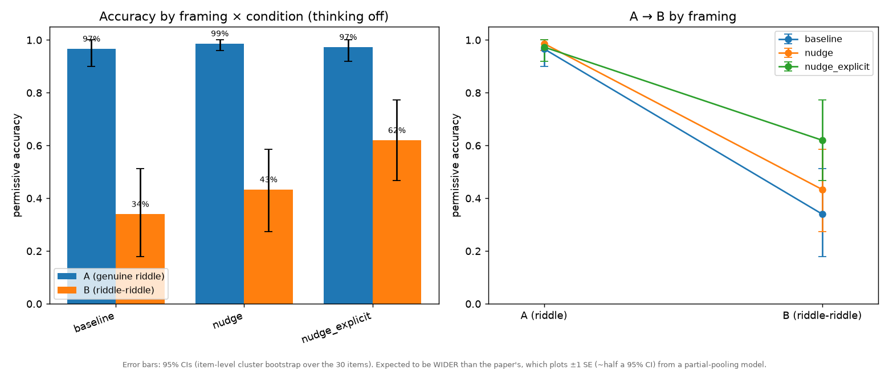
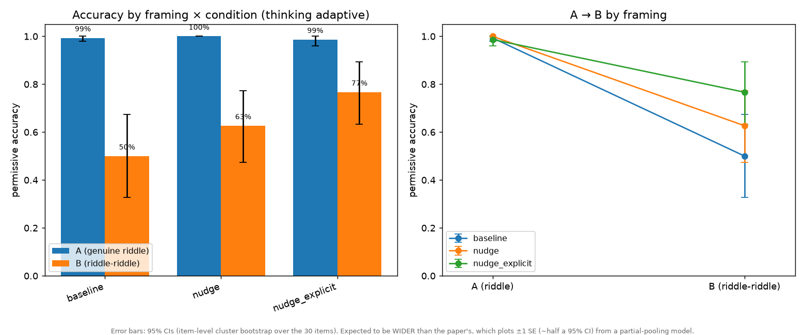

# Riddle riddles, revisited: how far framing, deliberation, and presentation move the "riddle prior" in Claude Opus 4.6

> This is an informal replication-and-extension of
> Fascendini, McGregor, Gupta & Griffiths, *"The Riddle Riddle: Testing Flexible
> Reasoning in Large Language Models and Humans"* (arXiv:2606.27103). 
> The code and this write-up were **authored by Claude (Opus 4.8)** and **steered by David P. Reichert**
> (disclosure: David works at Google DeepMind, but this was done in purely personal capacity).
> The code and write-up were not human-reviewed in detail, so take them with a grain of salt.
> That said, we reused various pieces from the original
> paper (e.g. judge code) and reproduce the original results on Opus 4.6. Code, data, and
> exact commands are in this repo so anything below can be checked.

## TL;DR

The paper's core, descriptive finding is robust and we reproduce it: by default,
Claude Opus 4.6 **falls into a "riddle prior"** — on *riddle riddles* (items that
look like classic lateral-thinking puzzles but have a plain literal answer) it
over-applies the inventive reading and scores far below its near-ceiling
performance on genuine riddles. But the *stronger* readings the paper invites —
"hasn't achieved flexible reasoning," "retrieval rather than reasoning" — need
qualification:

- A simple, **content-free** instruction to slow down (in effect: consider it
  carefully, and don't assume you've seen it before) and turning on **extended
  thinking** each move riddle-riddle accuracy up substantially and roughly
  **additively**, with **no cost** to genuine-riddle accuracy.
- An **explicit** cue (roughly: is this a real puzzle, or one that only looks like
  a puzzle? — work out which) plus thinking reaches **~human-level** on riddle
  riddles (77% vs the paper's humans' ~80%), while the model remains far
  **above** humans on genuine riddles (99% vs ~50%). Whether this cue "counts as
  cheating" depends on the question being asked (see §3).
- We also tested one *hypothesis* for why humans might do better — that seeing a
  mixed set lets a solver infer some items are fakes. Giving the model that
  human-style mixed session (several items in one conversation, no verbal hint)
  had **zero** effect; it does not infer the trick-or-not nature from context.
  (Whether humans actually rely on this is unknown — we only tested the model.)

Net: the over-application is best read as a **strong but largely overridable
default**, not an inability. Closing the gap for the model takes an explicit
verbal cue; the human-style *presentation* did nothing on its own. None of this
overturns the paper's descriptive result; it bounds the interpretation.

## Setup

- **Subject model:** Claude Opus 4.6 (`claude-opus-4-6`), default temperature.
- **Stimuli:** the paper's 30 matched pairs (60 items): condition **A** = genuine
  riddle (inventive answer intended), condition **B** = *riddle riddle* (literal
  answer intended). Used verbatim from the paper's repo.
- **Manipulations:** *framing* (the instruction wrapped around each item) ×
  *thinking* (off vs adaptive/extended) × condition, 5 repetitions/cell
  (n = 150 per cell), plus a separate **sequential** (human-equivalent) condition.
- **Scoring:** accuracy by an LLM judge (Claude Sonnet 4.6) under **both** the
  paper's **strict** (canonical answer only) and **permissive** (canonical +
  accepted alternatives) schemes. The judge code is the paper's, verbatim. We
  report **permissive** below (strict tracks it; the two disagree on ~3% of
  responses, almost all on one item). Confidence intervals are an **item-level
  cluster bootstrap** (resampling the 30 items), and effects are tested with a
  **paired within-item bootstrap**. These approximate, but are not, the paper's
  mixed-effects models — see Limitations.
- **What's ours vs reused:** the **generation harness** (querying the model across
  framings and thinking modes, and running the sequential sessions) is our own —
  the paper released its analysis but not the code that produced its LLM
  responses. The **judge** (prompts + scoring) is copied **verbatim** from the
  paper's repo, and the **stimuli** are theirs. So the model responses here are
  freshly generated; the scoring is the paper's.

## Results

### 1. Replication

Baseline prompt (the paper's exact instruction), thinking off:

| | A (genuine riddle) | B (riddle riddle) |
|---|---|---|
| ours (Opus 4.6) | 97% | 34% |
| paper (Opus 4.6) | ~99% | ~30% |

The large A→B collapse is exactly as reported. The pipeline lands on the paper's
own numbers.

### 2. Framing and thinking each recover B substantially, additively, and for free

Permissive **B** accuracy, framing × thinking (A stays 96–100% in every cell). The
framing glosses below are paraphrased — verbatim prompts are in Appendix A:

| Framing | thinking off | thinking adaptive |
|---|---|---|
| `baseline` (the paper's exact instruction) | 34% | 50% |
| `nudge` (anti-retrieval cue, roughly: consider carefully, don't assume you've seen it) | 43% | 63% |
| `nudge_explicit` (explicit cue, roughly: is this a real puzzle or one that only looks like it — work out which) | 62% | **77%** |

Paired within-item thinking effects on B are significant in most framings
(e.g. `baseline` +16pp [+5,+29]; `nudge` +19pp [+9,+31]), and the explicit cue's
effect decomposes cleanly: from baseline-off (34%), the **explicit cue alone**
adds ~+28pp (to 62%, paired +28 [+13,+43] vs baseline-off) and **thinking** adds a
further ~+15pp (to 77%, paired +15 [+3,+27]). The two levers **add**; they are not
redundant. Genuine-riddle accuracy is untouched throughout — the model does not
trade A for B.

We also checked whether the one-sentence **answer-format constraint** is doing
any work: `*_nobrevity` keeps the full instruction but drops only the brevity
limit. It isn't a meaningful lever — 3 of 4 paired comparisons are
non-significant; the lone exception (nudge+adaptive, −8pp) is marginal (one of
four tests, and the brevity effect flips sign between thinking off and on), so we
wouldn't read much into it. The drivers are the **cue content and thinking**, not
how the answer is formatted (per-cell numbers in Appendix B).




*Error bars are 95% CIs from an item-level cluster bootstrap. They are expected
to be **wider** than the paper's bars, which plot ±1 SE (≈ half a 95% CI) from a
partial-pooling mixed-effects model — so the visual difference is mostly the
interval choice, not extra noise. See Limitations.*

### 3. With an explicit cue + thinking, the model reaches ~human B and stays above human A

`nudge_explicit` + adaptive: **B = 77%, A = 99%**. The paper's humans:
**B ≈ 80.5%, A ≈ 50.5%**. So, appropriately prompted, Opus 4.6 **matches humans on
riddle riddles and far exceeds them on genuine riddles** — which complicates the
paper's "humans reason more flexibly" framing.

Whether the explicit cue "counts as cheating" depends on the question. It is the
**most informative** instruction we used — it tells the model, in words, that some
items only *look* like puzzles (though it reveals neither which item is which nor
any answer). For the question *"do these models only regurgitate the memorized
answer, or can they override it?"*, the cue is fair — the finding is that they
*can* override it. For the question *"can the model spot the non-riddles unaided,
the way a person might?"*, the cue is a hint and doesn't bear on it. The next
experiment targets that second question with no verbal hint.

### 4. The human-equivalent *presentation* does nothing on its own

To test one *hypothesis* for the human/LLM gap — that seeing a mixed set lets a
solver infer some items are pseudo-riddles — we presented **6-item
sessions (3 A + 3 B, distinct pairs, shuffled)** in **one multi-turn
conversation** with a **neutral** prompt (announcing the sequence and answer
format, with **no** hint about tricks). Compared against two single-shot controls:

| Condition (adaptive, permissive B, n=150) | B |
|---|---|
| `baseline` (single-shot, instruction in user turn) | 50% |
| `seq_control` (single-shot, same neutral instruction in a system prompt) | 48% |
| `sequential` (multi-turn context) | 47% |

Paired item-level tests, **all non-significant**: multi-turn context vs its
matched single-shot control = **+0pp [−8,+7]**; prompt placement = −2pp [−8,+3].
And riddle-riddle accuracy does **not** climb across within-session position
(56/44/44/44/42/54% for positions 1–6) — no "catching on."

So **context alone has no effect.** The model does not spontaneously extract
"some of these are not really riddles" from seeing a varied set; it stays at its
single-shot ~50%. We can't say whether humans actually use this contextual route
(the paper didn't isolate it) — we've only ruled it out for the model. Either way,
the model's gap closes only when it is explicitly *told*. (Caveat: this was the
weakest-motivated of our manipulations — a hunch about humans we wanted to check
on the model side, not a measured human effect.)

## Interpretation

It helps to separate two failures the "flexible reasoning" framing can conflate:
(1) failing to **recognize** that a literal reading suffices (strategy selection),
and (2) being unable to **execute** literal reasoning. Our results show **(2) is
intact** — genuine-riddle accuracy is at ceiling, and a one-line cue recovers
riddle riddles to human level. The failure is squarely **(1)**, and even (1) is
**largely prompt-recoverable**, with a real residual (~23% of riddle riddles are
still over-read even under the explicit cue).

So we read the phenomenon as a **strong but overridable default**, not an
inability or pure retrieval. The paper's robust descriptive claim — the model
falls into the riddle prior by default — stands and replicates. What this adds is
that (a) the capacity to do otherwise is present and cheaply elicited, and (b) the
model does **not** self-correct from a human-style mixed-context presentation — it
needs an explicit verbal cue (whether humans rely on context is untested). The
careful version of the paper's point survives; the stronger
"can't reason / only memorizes" reading does not.

## Limitations

- **Not human-reviewed in detail:** the code, analysis, and this write-up were
  produced by Claude with light human steering and were not audited line-by-line.
  (Offset by the verbatim judge and the baseline reproducing the paper's numbers —
  but stated plainly.)
- **One subject model** (Opus 4.6). The paper's own data show large between-model
  variation (e.g., Gemini 3.1 Pro generalized to B); we do not speak to that.
- **Statistics:** item cluster bootstrap and paired bootstrap, **not** the paper's
  mixed-effects logistic models. Conclusions are qualitative; we did not run the
  GLMM.
- **The explicit cue is the most informative** lever; how "fair" it is vs the
  human condition is a judgment call (see §3).
- **LLM-as-judge:** the paper's verbatim Sonnet 4.6 judge. We inherit its
  imperfections; strict/permissive agreement (~97%) is reassuring but not a human
  check.
- **Contamination going forward:** the stimuli are now public; treat the absolute
  numbers as a snapshot.

## Reproducibility

All code, prompts, and per-response data are in this repo. Key commands:

```
python generate.py --thinking off --reps 5          # framing × off
python generate.py --thinking adaptive --reps 5     # framing × adaptive
python generate_sequential.py --sessions 50         # human-equivalent sessions
python judge.py                                     # strict + permissive scoring
python judge.py --responses responses_seq.csv --scored scored_seq.csv
python analyze.py ; python plot.py --thinking off ; python plot.py --thinking adaptive
```

See the appendix for verbatim prompts, the full strict/permissive tables, and the
paired-test details.

---

## Appendix

### A. Verbatim framing prompts (`{item}` = the riddle text)

- **`baseline`:** *"Please provide one definitive answer to each word problem and a
  one-sentence explanation for how you arrived at it.\n\n{item}"*
- **`baseline_nobrevity`:** baseline with only the brevity limit dropped —
  *"Please provide one definitive answer to each word problem and an explanation
  for how you arrived at it.\n\n{item}"*
- **`nudge`:** *"Consider this problem carefully and do not assume you have
  encountered it before. Then give one definitive answer and a one-sentence
  explanation for how you arrived at it.\n\n{item}"*
- **`nudge_nobrevity`:** nudge with only the brevity limit dropped —
  *"Consider this problem carefully and do not assume you have encountered it
  before. Then give one definitive answer and an explanation for how you arrived
  at it.\n\n{item}"*
- **`nudge_explicit`:** *"This is either a lateral-thinking puzzle or a
  straightforward problem that only looks like a puzzle — work out which, and
  don't just assume you've seen this problem before. Then give one definitive
  answer and a one-sentence explanation for how you arrived at it.\n\n{item}"*
- **`seq_control` (system prompt; item is the user turn):** *"You will be given a
  word problem. Give one definitive answer and a one-sentence explanation for how
  you arrived at it."*
- **Sequential (system prompt; items are successive user turns):** *"You will be
  given a series of word problems, one at a time. For each, give one definitive
  answer and a one-sentence explanation for how you arrived at it."*

### B. Full accuracy table (permissive / strict), n=150 per cell

| Framing | thinking | A perm | B perm | A strict | B strict |
|---|---|---|---|---|---|
| baseline | off | 97 | 34 | 97 | 31 |
| baseline | adaptive | 99 | 50 | 99 | 45 |
| baseline_nobrevity | off | 98 | 36 | 97 | 31 |
| baseline_nobrevity | adaptive | 100 | 47 | 100 | 41 |
| nudge | off | 99 | 43 | 99 | 40 |
| nudge | adaptive | 100 | 63 | 100 | 56 |
| nudge_nobrevity | off | 99 | 49 | 99 | 44 |
| nudge_nobrevity | adaptive | 100 | 55 | 99 | 50 |
| nudge_explicit | off | 97 | 62 | 97 | 54 |
| nudge_explicit | adaptive | 99 | 77 | 99 | 72 |
| seq_control | adaptive | 99 | 48 | 99 | 43 |
| sequential | adaptive | 100 | 47 | 99 | 42 |

(The committed data also includes bare-item `*_unconstrained` variants — the
whole instruction removed, rather than just the brevity limit — which we do not
analyze here.)

### C. Paired within-item effects (permissive B, item cluster bootstrap, 10k)

- Thinking (adaptive − off): baseline +16pp [+5,+29]; nudge +19 [+9,+31];
  nudge_explicit +15 [+3,+27].
- Explicit cue at off: nudge_explicit − nudge +19 [+8,+31]; − baseline +28 [+13,+43].
- `nudge_explicit` − `nudge` (both adaptive): +14 [+1,+27].
- Brevity constraint (`*_nobrevity` − full, B): baseline-off +2 [−3,+9] ns;
  baseline-adaptive −3 [−10,+4] ns; nudge-off +5 [−1,+12] ns;
  **nudge-adaptive −8 [−15,−3]** (the only significant one).
- Presentation (adaptive): seq_control − baseline −2 [−8,+3] ns;
  **sequential − seq_control +0 [−8,+7] ns**; sequential − baseline −2 [−11,+7] ns.

### D. A few qualitative failures (riddle riddles over-read as the original riddle)

- **18B** ("…injecting **venom** with a single bite. What am I?") — the literal
  answer is a venomous animal; the model answered **"a stapler"** (the original
  18A answer).
- **24B** (she *does* hold, *does* bite, has sight) — literal answer: a real woman;
  the model answered **"a doll"** and then contradicted the prompt to defend it
  ("hands but can't hold… eyes but cannot see").
- **29B** (lion hasn't eaten in three **days**; door one leads to "a room of
  nothing") — literal answer: door one; the model applied the three-*years*
  trick: **"third door, the lion is dead from starvation."**

### E. Methods notes

- Subject calls: `claude-opus-4-6`, default temperature; thinking off =
  `thinking:{type:"disabled"}`, adaptive = `thinking:{type:"adaptive"}`,
  `output_config.effort:"high"`. Each cell is 30 items × A/B × 5 reps.
- Sequential: 6-item sessions (3 A + 3 B from distinct pairs, shuffled); each item
  is a user turn in one conversation; 50 sessions (n=150 B). Position is balanced
  across sessions by randomization (verified ~50% B at each position over many
  sessions).
- Judge: `claude-sonnet-4-6`, temperature 0, max_tokens 400; prompts and scoring
  code copied verbatim from the paper's `llm_exp_judge_pipeline.py`.
